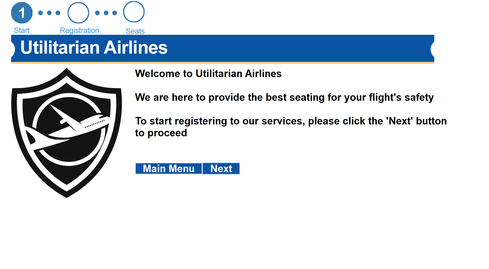
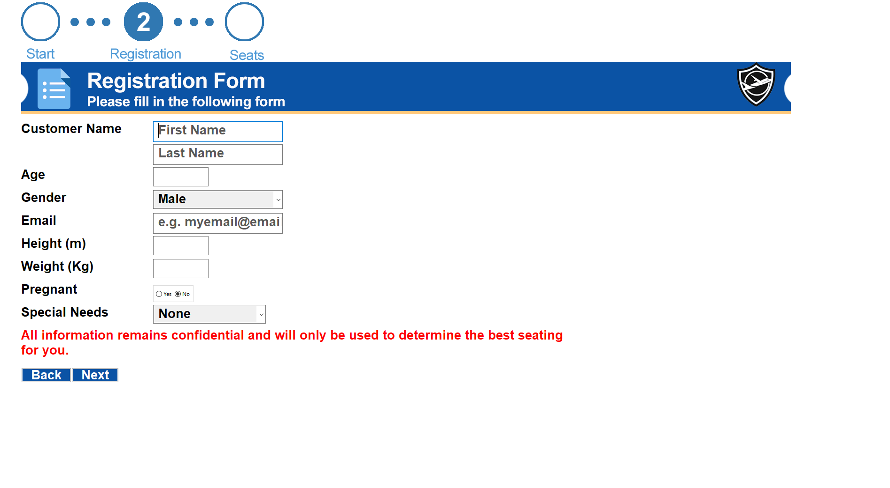
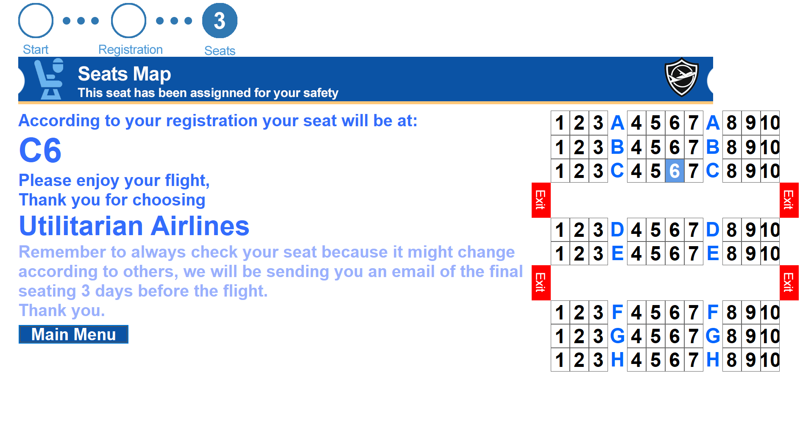
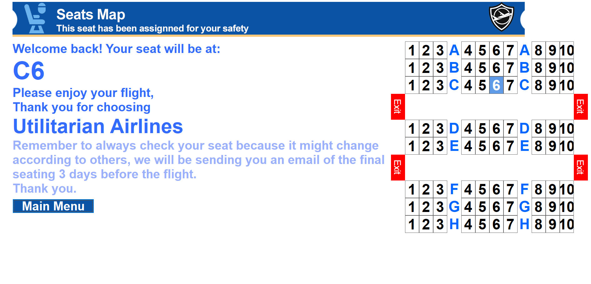

<!-- PROJECT LOGO -->
<br />
<div align="center">
  <a href="https://github.com/GiantSweetroll/DSA-PathFinding">
    
  </a>
  <h3 align="center">Utilitarian Airlines</h3>
  <p>
    An app that places people in an aircraft in such a way that can benefit humanity best in times of emergency. Made using C++.
  </p>
</div>


<!-- TABLE OF CONTENTS -->
<details open="open">
  <summary><h2 style="display: inline-block">Table of Contents</h2></summary>
  <ol>
    <li>
      <a href="#about-the-project">About The Project</a>
      <ul>
        <li><a href="#built-with">Built With</a></li>
      </ul>
    </li>
    <li>
      <a href="#getting-started">Getting Started</a>
      <ul>
        <li><a href="#prerequisites">Prerequisites</a></li>
        <li><a href="#installation">Installation</a></li>
      </ul>
    </li>
    <li><a href="#usage">Usage</a></li>
    <li><a href="#license">License</a></li>
    <li><a href="#contact">Contact</a></li>
    <li><a href="#acknowledgements">Acknowledgements</a></li>
    <li><a href="#screenshots">Screenshots</a></li>
  </ol>
</details>


<!-- ABOUT THE PROJECT -->
## About The Project

<!-- [![Project Screen Shot][product-screenshot]](https://github.com/GiantSweetroll/DSA-PathFinding) -->

This is a group project by Bently Edyson, Jason Christian, and Gardyan Akbar for Data Structures and Algorithms course. This app allows you to book a ticket to board an airplane, however, you are not able to manually set your seats. Instead, an algorithm is used to place your seating in such a way that would allow people that are deemed more beneficial for the human race to have a higher chance of surviving in times of emergency. This project is used to demonstrate the power of data structures in managing people and not to be taken literally as something that should be implemented in every airline.

### Built With

* [C++](https://www.cplusplus.com/)


<!-- GETTING STARTED -->
## Getting Started

To get a local copy up and running follow these simple steps.

### Prerequisites

* [Visual Studio 2019](https://visualstudio.microsoft.com/)
* [wxWidgets 3.1.3](https://www.wxwidgets.org/)

### Installation

1. Clone the repo
   ```sh
   git clone https://github.com/GiantSweetroll/DSA-PathFinding.git
   ```
1. According to your setup, you might need to make sure the project properly links to where you installed wxWidgets.


<!-- USAGE EXAMPLES -->
## Usage
When you first open the app, you will be greated with the landing page. From here, you need to first register a seat.
<div align="center">
  
</div>

Next follow the prompts on the screen to register your seating. Remember to take note of your email as this will be used to check back your seating.
<div align="center">
  <table class="tableImageCaption">
    <tr>
      <td>  </td>
      <td>  </td>
      <td>  </td>
    </tr>
    <tr>
      <td> <p align="center"><i>Begin registration</i></p> </td>
      <td> <p align="center"><i>Enter details</i></p> </td>
      <td> <p align="center"><i>View seating</i></p> </td>
    </tr>
  </table>
</div>

After registering, you can check your seating again by pressing the "View Seat" button in the main menu and entering your email address you used to register.

<div align="center">
  
</div>

<!-- LICENSE -->
## License

Distributed under the Apache-2.0 License. See `LICENSE` for more information.


<!-- CONTACT -->
## Contact

Bently Edyson - bentlyedyson@gmail.com <br>
Jason Christian - [LinkedIn](https://www.linkedin.com/in/jasoncoding/) - nakamarujc@gmail.com <br>
Gardyan Priangga Akbar - [LinkedIn](https://www.linkedin.com/in/gardyanakbar/) - gardyanakbar99@gmail.com

Project Link: [https://github.com/GiantSweetroll/DSA-PathFinding](https://github.com/GiantSweetroll/DSA-PathFinding)


<!-- ACKNOWLEDGEMENTS -->
## Acknowledgements

* [wxWidgets](https://www.wxwidgets.org/)


<!-- SCREENSHOTS -->
<details open="open">
  <summary><h2 style="display: inline-block">Screenshots</h2></summary>
  
  
  
  
  
</details>


<!-- MARKDOWN LINKS & IMAGES -->
<!-- https://www.markdownguide.org/basic-syntax/#reference-style-links -->
[contributors-shield]: https://img.shields.io/github/contributors/github_username/repo.svg?style=for-the-badge
[contributors-url]: https://github.com/github_username/repo/graphs/contributors
[forks-shield]: https://img.shields.io/github/forks/github_username/repo.svg?style=for-the-badge
[forks-url]: https://github.com/github_username/repo/network/members
[stars-shield]: https://img.shields.io/github/stars/github_username/repo.svg?style=for-the-badge
[stars-url]: https://github.com/github_username/repo/stargazers
[issues-shield]: https://img.shields.io/github/issues/github_username/repo.svg?style=for-the-badge
[issues-url]: https://github.com/github_username/repo/issues
[license-shield]: https://img.shields.io/github/license/github_username/repo.svg?style=for-the-badge
[license-url]: https://github.com/github_username/repo/blob/master/LICENSE.txt
[linkedin-shield]: https://img.shields.io/badge/-LinkedIn-black.svg?style=for-the-badge&logo=linkedin&colorB=555
[linkedin-url]: https://linkedin.com/in/github_username
[product-screenshot]: img/register3.PNG
